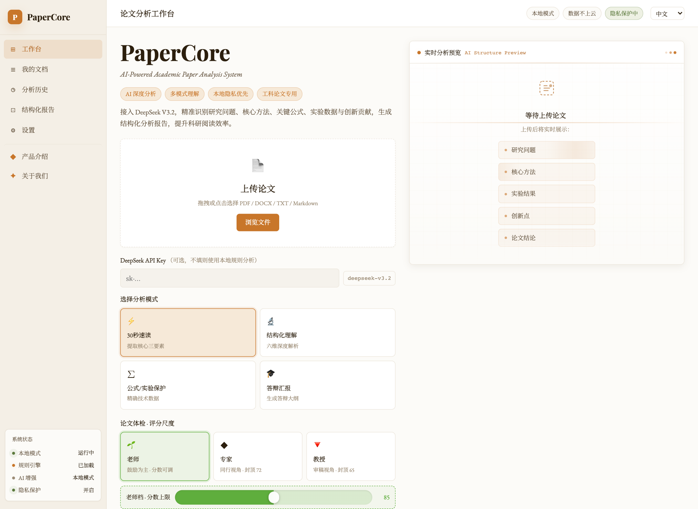

# PaperCore

**从论文的核心问题出发，回到原文理解。**

[English](README.md) · 简体中文

论文结构化阅读 · 本地优先 · 原文对照

---

## 关于 PaperCore

PaperCore 是一款正在开发的论文阅读辅助工具，面向学生与研究人员，帮助读者整理一篇论文的研究问题、核心方法、实验结果与结论，再回到原文逐项核对。

它希望减少查找与整理信息的重复工作，让读者把时间用在理解方法、判断证据和形成自己的思考上。分析结果是阅读线索，仍需结合原文判断。

## 可以做什么

| 阅读环节 | 当前开发版本提供的功能 |
|---|---|
| 导入文档 | 导入 PDF、DOCX、TXT 和 Markdown，解析文档内容；扫描件可使用本地 OCR |
| 梳理论文 | 按研究问题、方法、实验和结论等维度呈现内容 |
| 核对原文 | 在结果页面查看原文对照，辅助检查提取内容 |
| 保存与回看 | 查看分析历史、管理文档，导出 Markdown 或 TXT 报告 |
| 选择分析方式 | 使用本地规则分析，也可按配置选择本地模型或云端 AI 增强 |

本地模式在运行 PaperCore 的设备上处理文档。启用云端 AI 时，相关内容会发送到所选服务商；实际数据处理方式取决于部署环境与配置。

## 界面预览

*开发版本的工作台界面。截图用于展示交互与布局，界面中的模式名称、评分和提示不代表准确率或处理速度承诺。*

## 当前进展

PaperCore 目前处于开发与内部验证阶段。已有文档导入、结构化提取、原文对照、历史记录和报告导出流程，下一步重点是：

- 检查提取内容是否得到原文支持，改善原文定位。
- 完善人工标注与复核，再逐步扩大验证范围。
- 根据实际阅读反馈，改进结果呈现与使用体验。

公开在线演示尚未开放，开放后将在本页更新入口。当前没有可公开下载的安装包。

## 项目与反馈

PaperCore 由 **朱厚臻** 开发。本仓库用于发布项目介绍、界面截图和开发进展，软件源码保存在私有仓库中。

欢迎通过 [Issues](https://github.com/drkiyira-dev/PaperCore-Showcase/issues) 提交功能建议或使用场景。反馈中请勿上传未公开论文、账号信息或 API 密钥。

## 版权

Copyright © 2026 朱厚臻. All rights reserved.

PaperCore 为专有软件，不提供开源许可。本仓库的公开展示不构成对软件源码、原创文案或图片的开源授权。具体说明见 [LICENSE](LICENSE)。

---

PaperCore / Read with evidence.

