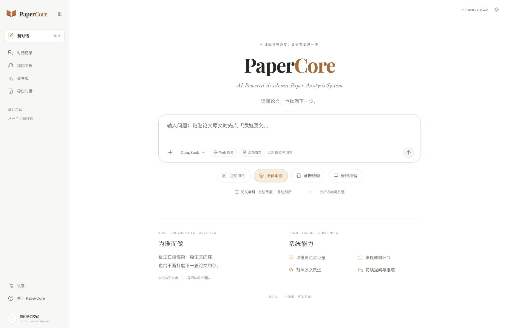

# PaperCore

**回到原文，核对证据，改进论证。**

[English](README.md) · 简体中文

论文诊断 · 逻辑审查 · 证据核验 · 答辩准备

---

## 与论文一起思考的工作区

PaperCore 帮助学生和研究者检查论文提出了什么主张、证据能支持到哪里，以及还有哪些问题需要改进。2.0 开发版将持续对话、原文对照、带出处的检索和证据核验放在同一个工作区。

从一篇论文或一个问题开始，沿引用返回原文，用有依据的改写完善论证，同时保留尚未解决的问题。

## 当前版本已有的能力

| 任务 | 开发版中的实现 |
|---|---|
| 阅读材料 | PDF、DOCX、TXT、Markdown 和图片；可选本地 OCR 与自行配置的视觉模型 |
| 检查论证 | 论文诊断、逻辑审查、证据核验、答辩准备四类方向可组合使用 |
| 追溯依据 | 对话与原文并排显示，段落引用定位、阅读记录及证据缺口 |
| 核验主张 | 核对结论范围，检索支持与反证，实际读取来源，明确标记未解决状态 |
| 改进表述 | 可复制改写先检查引用、数值、单位和计算，再由模型检查证据关系 |
| 检索段落 | 可选语义与图谱检索，选中的段落须重新对应当前版本的原文 |
| 持续推进 | 保存研究目标与未解决问题、模型交接、对话重命名／删除、Markdown 导出和每轮耗时 |

追问区分讨论、局部改写和新增主张。点击当前模型名即可切换模型；粘贴论文文字需要成为可引用材料时，先开启「添加原文」。

原主张尚未证实，也可以形成有依据的限定改写；缺少全文或服务错误，不等于科学结论错误。自动检查辅助人工复核，不构成科学正确性的保证。

## 界面预览

*更新于 2026 年 10 月 8 日。使用 Google Chrome 截取完整桌面首页，包含侧栏和页尾。截图来自空白本地工作区，不含上传论文、对话记录或密钥。当前展示的是中文界面，支持白色、暖色和黑色三种主题。*

## 数据与连接服务

文档、历史及证据记录保存在本机。分析会将相关文字和图片发送给用户配置的模型服务；发生故障时，其他已配置且可用的模型可能接替处理。这不是完全离线的分析模式。

可选语义检索通过云端向量化与重排、本机 Chroma 和 LightRAG 索引协作完成。研究与开发记忆隔离保存；记忆和图谱命中需要返回当前原文检查，才能作为证据使用。

外部文献检索默认关闭。来源包括 OpenAlex、Crossref、arXiv、PMC/Europe PMC 和 Unpaywall，以及可选的 AMiner、Semantic Scholar、博查发现服务；实际可用性取决于配置和权限。中文学术适配器仍在验证，维普尚不能视为已验证可用，乐问尚未集成。

Web 开关控制外部文献搜索，**不会关闭云端模型、向量化或重排调用**。检索命中、取得全文与证据是否支持主张分别记录。

## 开发状态

**PaperCore 2.0 目前是内部开发预览版。** 10 月 8 日更新加强了证据关系、出处版本、连续追问、模型交接与改写检查；更大范围的独立人工标注评测仍待推进。自动回归测试使用固定样例和模拟服务检查流程行为，不代表整体准确率。

公式专项核验和知网集成尚未实现。目前没有公开在线演示或公开安装包，准备好后会在这里补充入口。

## 项目与反馈

PaperCore 由 **朱厚臻（Zhu Houzhen）** 开发。本仓库只提供项目介绍与界面展示，软件源码保存在私有仓库。

欢迎通过 [Issues](https://github.com/drkiyira-dev/PaperCore-Showcase/issues) 提供阅读场景和功能建议。公开反馈请勿包含未发表论文、账户信息或 API 密钥。

## 版权

Copyright © 2026 朱厚臻. All rights reserved.

PaperCore 为专有软件。公开展示不构成对软件、原创文案或图片的开源授权，详见 [LICENSE](LICENSE)。

---

PaperCore / 回到证据。

